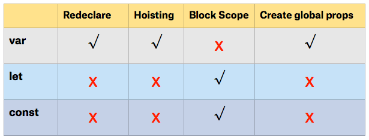

# JavaScript Function & Variable Declaration

## JavaScript Functions

Function is a feature of JavaScript that allow us to **do something** whenever the function is **called**

---

## How to use

### with regular `function` keyword

Syntax:

`function name() {}`

```js
function myFunction(total_price, name) {
  total_tax = total_price * 0.1;

  detail_tax = `name: ${name}, tax:${total_tax}`;
  return detail_tax;
}
```

### with variable function

Syntax:

`const x = function() {}`

```js
const myFunction = function(total_price, name) {
  total_tax = total_price * 0.1;

  detail_tax = `name: ${name}, tax:${total_tax}`;
  return detail_tax;
};
```

### with arrow function

Syntax:

`const x = () => {}`

```js
//example 1
var names = ["Budi", "Joni", "Tono", "Jaka"];

var modified_name = names.map(name => "Mr." + name);

// with function inside var
var funct = name => "Mr." + name;

var modified_name = names.map(funct);
```

### Recursive function

Syntax:

`function name() { name() }`

```js
function factorial(n, accumulator) {
  if (n === 0) {
    return accumulator
  }
  return factorial(n — 1, n * accumulator)
}
factorial(5, 1)
```

---

## `var` vs `let` vs `const`

### **var**

Variables can be re-declared and updated.

```js
var greeter = "hey hi";
var greeter = "say Hello instead";
```

Not block scoped.

```js
var b = 2;
var condition = true;
if (condition) {
    var b = 3
}
console.log(b) //=> 3
```

var variables are hoisted to the top of its scope and initialized with a value of undefined.

example:

```js
x = 10;
var x;
console.log(x); //10
```

or :

```js
var x
x=10
console.log(x) //=> 10
```

### **let**

Can be updated but not redeclared.

```js
let greeting = "say Hi";
greeting = "say Hello instead";
```

Block scoped.

```js
let b = 2;
let condition = true;
if (condition) {
    let b = 3
}
console.log(b) //=> 2
```

### **const**

`const` declarations are block scoped, cannot be updated or re-declared.

```js
const greeting = "say Hi";
const greeting = "say Hello instead"; //error : Identifier 'greeting' has already been declared
```

block scoped

```js
const b = 2;
let condition = true;
if (condition) {
    const b = 3
}
console.log(b) //=> 2
```

---

## Summary




